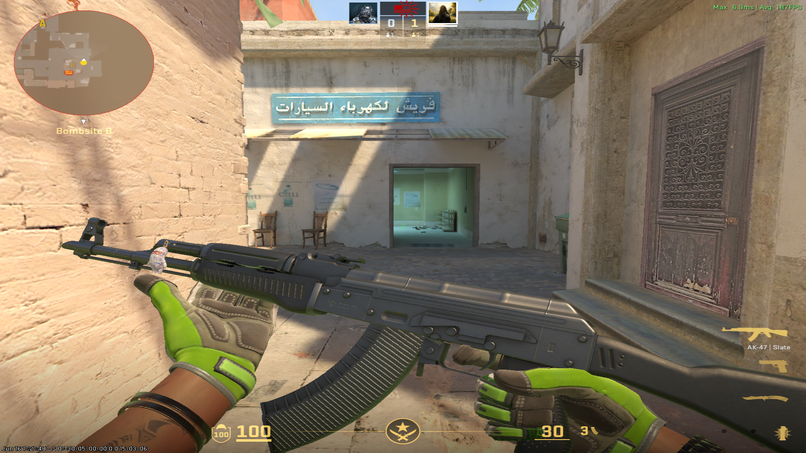
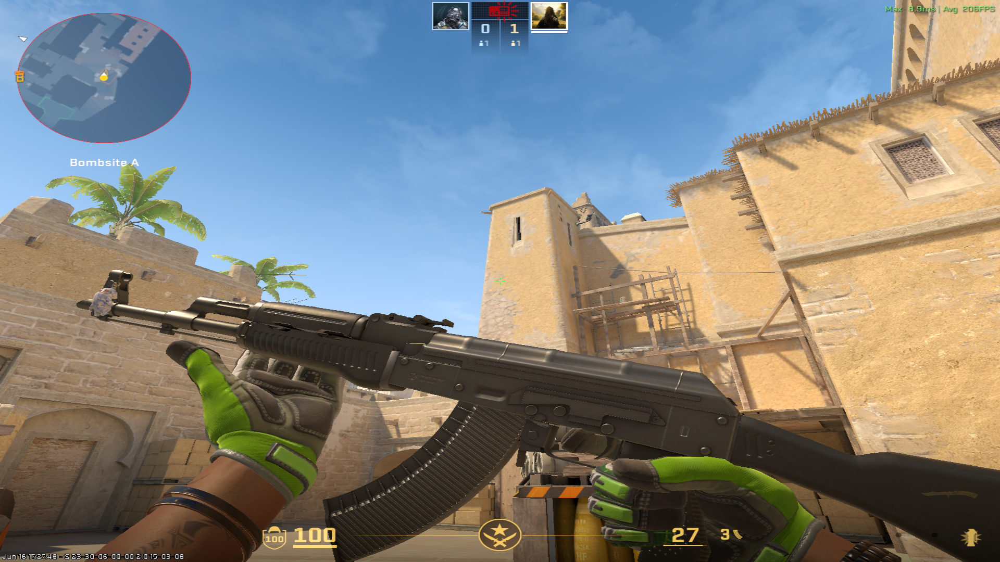

# CS2 Keychain Extractor

A tiny tool to extract CS2 keychain coordinates (x, y, z) directly from the browser when generating an inspect link on cs2inspects.com.

It intercepts the network payload via a native browser extension and sends the coordinates to a local Python script to automatically copy them to your clipboard.

Works on Linux (Wayland/X11), Windows, and macOS.

## Contributing
Got a sick charm placement? Add it to the public archive!
1. Fork the repo.
2. Drop your screenshot in the `images/` folder (e.g., `glock18-grip.png`).
3. Add your image and X/Y/Z coordinates to the "Common Placements" list below.
4. Open a PR.

## Setup

### 1. Start the Clipboard Server
Run the Python script in a terminal. It listens for the extension and handles clipboard copying. No dependencies required.
```bash
python3 server.py
```
*(Linux: make sure `wl-clipboard` or `xclip` is installed)*

### 2. Install the Extension

#### Temporary 
1. Open Firefox / Zen Browser and go to `about:debugging`.
2. Click **This Firefox** on the left.
3. Click **Load Temporary Add-on...**
4. Select the `manifest.json` file inside the `extension/` folder.

#### Permanent
1. Go to `about:config`.
2. Search for `xpinstall.signatures.required` and set it to `false`.
3. Drag and drop `cs2-extractor.xpi` into your browser window and click **Add**.

## Usage
1. Keep `server.py` running.
2. Go to cs2inspects.com and set up your weapon.
3. Click the **Inspect In-Game** button.
4. Your coordinates are instantly copied to your clipboard: `!charm_set <x> <y> <z>`

> [!NOTE]
> **For Developers:** The `!charm_set` output is formatted for a custom chat command used on my specific CS2 server, rather than a public plugin. You can easily write your own server-side plugin to parse this exact chat format and apply the coordinates for your own testing!

---

## Common Placements

Don't want to use the extractor? Here's a master list of common charm placements. 

---

### Rifles

<details>
<summary><strong>AK-47</strong></summary>
<br>

#### Placement 1


- **X:** `24.32`
- **Y:** `0.23`
- **Z:** `4.08`
> **Command:** `!charm_set 24.32 0.23 4.08`

---

#### Placement 2


- **X:** `19.20`
- **Y:** `0.39`
- **Z:** `3.49`
> **Command:** `!charm_set 19.20 0.39 3.49`

---

#### Placement 3


- **X:** `24.40`
- **Y:** `0.23`
- **Z:** `3.61`
> **Command:** `!charm_set 24.40 0.23 3.61`

</details>

<details>
<summary><strong>M4A1-S</strong></summary>
<br>

*(Add M4A1-S placements here)*

</details>
